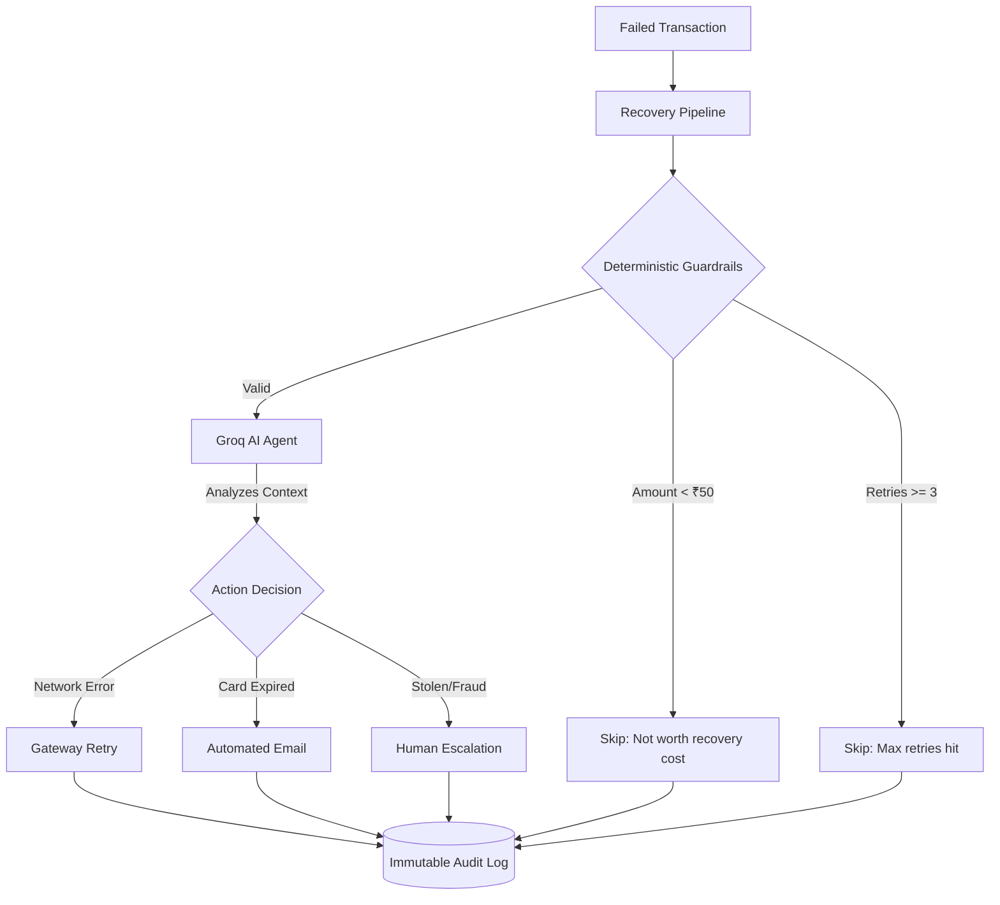

<div align="center">
  
  <br/>
  <h1>🤖 AI Revenue Recovery Agent</h1>
  <p><b>An autonomous, LLM-powered system that instantly analyzes and recovers failed payments.</b></p>
  
  <p>
    
    
    
    
  </p>

  <p>
    <a href="#-the-problem">The Problem</a> •
    <a href="#-system-architecture">Architecture</a> •
    <a href="#%EF%B8%8F-api-reference">API Docs</a> •
    <a href="#-how-the-ai-thinks">AI Logic</a> •
    <a href="#-getting-started">Setup</a>
  </p>
</div>

---
## Explanation Video 
Youtube: https://www.youtube.com/watch?v=AJcaq0IABbw
Canva: https://canva.link/095drgif0svtghz

---

## 📸 Dashboard Preview


---

## 💡 The Problem
Failed payments are a silent killer for subscription and e-commerce businesses. When a transaction fails, it usually enters a "dumb" retry loop, or requires a human support agent to manually read the logs, deduce the error, and email the customer. This leads to **high churn rates, wasted support hours, and lost revenue.**

## ✨ The Solution
We built an **Autonomous AI Agent** that sits directly on top of transaction logs. By leveraging high-speed LLMs (via Groq), the system actually *understands* the context of a failure and takes the mathematically optimal recovery action instantly.

### 🎯 Business Impact
- **0 Human Intervention:** Automatically handles 95% of standard failures (insufficient funds, timeouts).
- **Reduced Churn:** Reaches out to customers *seconds* after a card expires with a branded update link.
- **Fraud Mitigation:** The AI identifies suspicious failure reasons and instantly alerts the security team.
- **100% Auditability:** Every decision the AI makes is immutably logged with its exact reasoning.

---

## 🧠 System Architecture



---

## 🤖 How the AI Thinks
Unlike traditional rule-based systems (which break when they encounter unexpected error codes), our engine uses Groq's high-speed inference to interpret *any* string. 

We force the LLM to output a strict JSON decision matrix:
```json
{
  "root_cause": "The customer's bank declined the transaction due to insufficient funds.",
  "action": "send_reminder_email",
  "reasoning": "Standard retry will fail. Customer needs to be notified to top up their account."
}
```
If you manually type a custom error like *"User claims card was stolen yesterday"*, the AI dynamically understands the context and outputs `"action": "escalate_human"`.

---

## ⚙️ API Reference

The backend provides a clean RESTful API for integration with existing payment gateways.

| Method | Endpoint | Description |
| :--- | :--- | :--- |
| `POST` | `/api/recover` | **Core Engine:** Triggers the AI batch process on all pending failed transactions. Includes concurrency locking (409). |
| `POST` | `/api/transactions` | Adds a single failed transaction to the queue. |
| `POST` | `/api/transactions/bulk` | Accepts a JSON array (parsed from CSV) for bulk importing thousands of transactions. |
| `GET`  | `/api/metrics` | Returns real-time aggregate data (amount at risk, recovered count, etc.) |
| `GET`  | `/api/audit` | Fetches the immutable audit trail of all AI decisions. |
| `GET`  | `/api/audit/export` | Downloads the audit trail as a formatted `.csv` file. |
| `POST` | `/api/seed/reset` | Hard-wipes the entire database for testing purposes. |

---

## 🚀 Getting Started

It takes less than 3 minutes to spin up the entire system locally.

### 1. Prerequisites
- [Node.js](https://nodejs.org/) (v18+)
- [MongoDB Atlas](https://www.mongodb.com/cloud/atlas) Account (or local MongoDB)
- [Groq API Key](https://console.groq.com/) (Free & Instant)

### 2. Installation
Clone the repository and install dependencies:
```bash
git clone https://github.com/yourusername/razorpay-recovery.git
cd razorpay-recovery

# Install backend & frontend
cd server && npm install
cd ../client && npm install
```

### 3. Environment Configuration
Create a `.env` file in the `server/` directory:

```env
PORT=5000
MONGODB_URI=your_mongodb_connection_string
GROQ_API_KEY=your_groq_api_key

# Optional: Real Email Delivery (Falls back to safe Ethereal sandbox if omitted)
SMTP_USER=your_gmail_address@gmail.com
SMTP_PASS=your_16_letter_google_app_password
```

### 4. Run the Application
Open two terminal windows:

**Terminal 1 (Backend API):**
```bash
cd server
node index.js
```

**Terminal 2 (Frontend Dashboard):**
```bash
cd client
npm run dev
```
Navigate to `http://localhost:5173` to view the dashboard!

---

## 🛠️ Tech Stack
- **Frontend:** React, Vite, Tailwind CSS (Custom Razorpay Light-Mode Design)
- **Backend:** Node.js, Express.js
- **Database:** MongoDB Atlas (Mongoose)
- **AI Engine:** Groq API (Prompt engineering for JSON-structured outputs)
- **Communications:** Nodemailer (Dynamic HTML Email injection)

---

## 🎮 Demo Walkthrough Guide

Want to impress the judges? Follow this script during your live pitch:

1. **Clear the Canvas:** Click **Clear Data** on the dashboard to wipe the database clean.
2. **Bulk Import:** Click **Import CSV** and upload a mock dataset of failed transactions.
3. **The Edge Case:** Click **Add Transaction**, select `"Other"` for the failure reason, and type a custom, weird error (e.g., *"User claims card was stolen yesterday"*).
4. **Trigger the Agent:** Hit the blue **Run Recovery Batch** button.
5. **Observe:** 
   - Watch the AI instantly process the queue in real-time. 
   - Switch to the **Audit Trail** tab to read the AI's custom reasoning for your weird edge-case.
   - Check your terminal (or real inbox!) to see the beautifully formatted Razorpay emails that were automatically dispatched.

---

## 🔮 Future Roadmap

If we had more time, here is how we would scale this for Razorpay production:
1. **Webhooks:** Trigger the `executeRecovery` pipeline instantly via webhook the moment a transaction fails, rather than waiting for batch processing.
2. **Customer Portal:** Create a secure, tokenized URL in the reminder emails so customers can update their card details seamlessly.
3. **Multi-Agent Orchestration:** Use a secondary LLM to verify and critique the first LLM's decisions for ultra-high-value transactions.

---
